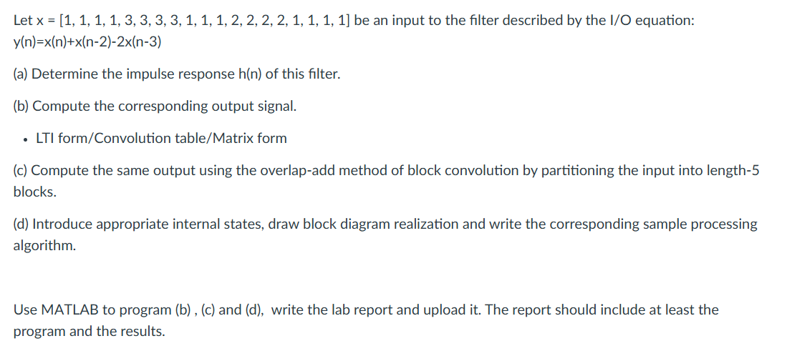
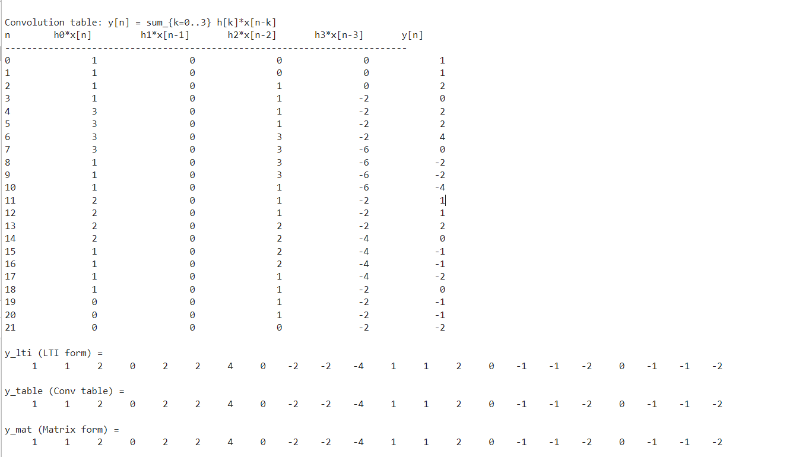
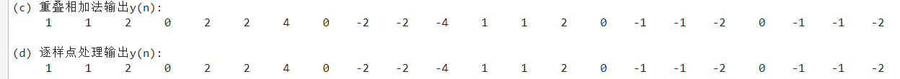
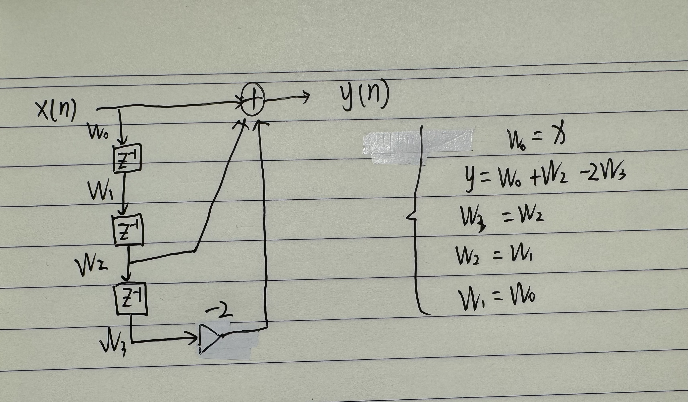

解答：(a) 确定单位冲激响应 $h(n)$

根据系统的差分方程 $y(n) = x(n) + x(n-2) - 2x(n-3)$，令输入为单位冲激信号 $x(n) = \delta(n)$：

* $h(0) = \delta(0) = 1$
* $h(1) = 0$
* $h(2) = \delta(0) = 1$
* $h(3) = -2\delta(0) = -2$

**结论：**
$h(n) = [1, 0, 1, -2]$，其中 $n = 0, 1, 2, 3$。

### (b)(c)(d)实现代码如下:

#### MATLAB 实现代码 (b):
```matlab
clc; clear;

% 输入与冲激响应
x = [1, 1, 1, 1, 3, 3, 3, 3, 1, 1, 1, 2, 2, 2, 2, 1, 1, 1, 1];
h = [1, 0, 1, -2];  

L = length(x);
M = length(h);
N = L + M - 1;

%% 形式1：LTI form
% y[n] = x[n] + x[n-2] - 2x[n-3]
y_lti = zeros(1, N);
xpad  = [x, zeros(1, M-1)];

for n = 1:N
    term0 = xpad(n);
    term2 = 0; term3 = 0;
    if (n-2) >= 1, term2 = xpad(n-2); end
    if (n-3) >= 1, term3 = xpad(n-3); end
    y_lti(n) = term0 + term2 - 2*term3;
end

%% 形式2：Convolution table
T = zeros(N, M);  % T(n+1,k+1) = h[k]*x[n-k]

for n = 0:N-1
    for k = 0:M-1
        idx = n - k;
        if idx >= 0 && idx < L
            T(n+1, k+1) = h(k+1) * x(idx+1);
        else
            T(n+1, k+1) = 0;
        end
    end
end

y_table = sum(T, 2).';  % 卷积表每行求和得到 y[n]

% 打印卷积表（每个 n 的4项贡献 + y[n]）
fprintf('\nConvolution table: y[n] = sum_{k=0..%d} h[k]*x[n-k]\n', M-1);
fprintf('n\t h0*x[n]\t h1*x[n-1]\t h2*x[n-2]\t h3*x[n-3]\t y[n]\n');
fprintf('--------------------------------------------------------------------------\n');
for n = 0:N-1
    fprintf('%d\t %8g\t %10g\t %10g\t %10g\t %8g\n', ...
        n, T(n+1,1), T(n+1,2), T(n+1,3), T(n+1,4), y_table(n+1));
end

%% 形式3：Matrix form
xcol = x(:);
hcol = h(:);

c = [hcol; zeros(L-1,1)];       % 第一列 (N x 1)
r = [hcol(1); zeros(L-1,1)];    % 第一行 (L x 1)
H = toeplitz(c, r);             % (N x L)

y_mat = (H * xcol).';           % 行向量

%% 直接输出三个结果
disp(' ');
disp('y_lti (LTI form) =');     disp(y_lti);
disp('y_table (Conv table) ='); disp(y_table);
disp('y_mat (Matrix form) =');  disp(y_mat);

```

#### MATLAB 实现代码 (c):
```matlab
L_block = 5; % 块长度
M = length(h);
x_padded = [x, zeros(1, L_block - mod(length(x), L_block))]; 
y_ola = zeros(1, length(x_padded) + M - 1);

for i = 1:L_block:length(x)
    x_block = x(i:min(i+L_block-1, length(x)));
    y_block = conv(x_block, h);
    % 在重叠位置进行累加
    idx = i : i + length(y_block) - 1;
    y_ola(idx) = y_ola(idx) + y_block;
end

% 截取有效部分
y_ola = y_ola(1:length(x) + M - 1);

% 显示结果
fprintf('(c) 重叠相加法输出y(n):\n');
disp(y_ola);
```
#### MATLAB 实现代码 (d):
```matlab
% 初始化状态
w1 = 0; w2 = 0; w3 = 0;
x_ext = [x, 0, 0, 0]; % 补零以清空系统状态
y_sample = zeros(1, length(x_ext));

for n = 1:length(x_ext)
    curr_x = x_ext(n);
    % 计算当前输出
    y_sample(n) = curr_x + w2 - 2 * w3;
    % 更新状态
    w3 = w2;
    w2 = w1;
    w1 = curr_x;
end

% 显示结果
fprintf('(d) 逐样点处理输出y(n):\n');
disp(y_sample);
```
### 运行结果及分析:
(b)



(c)(d)



所有方案结果一致

### 框图:


