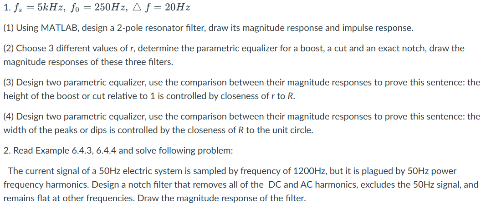
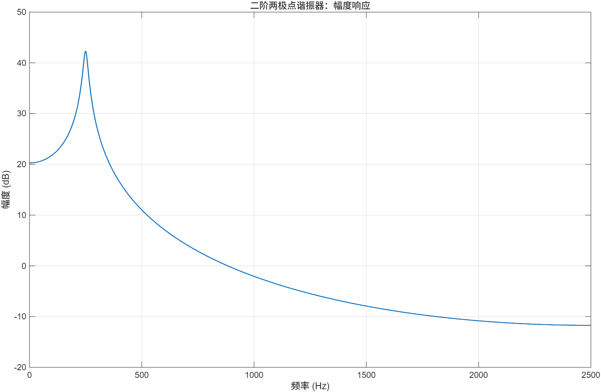
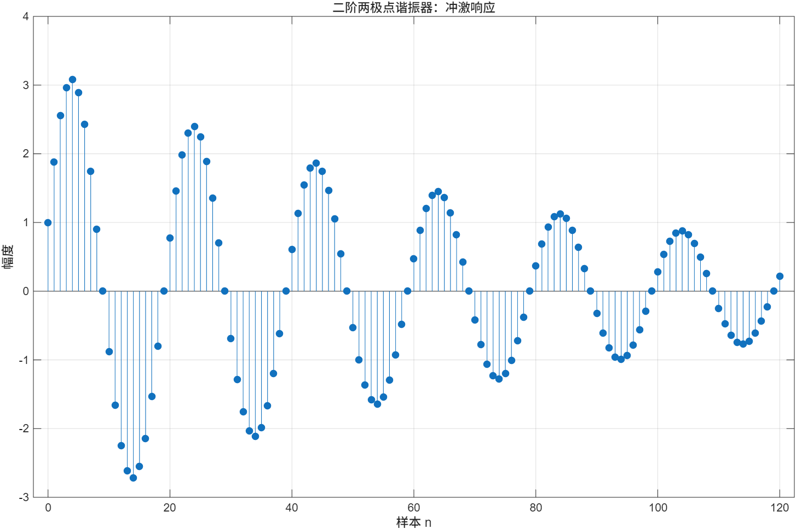
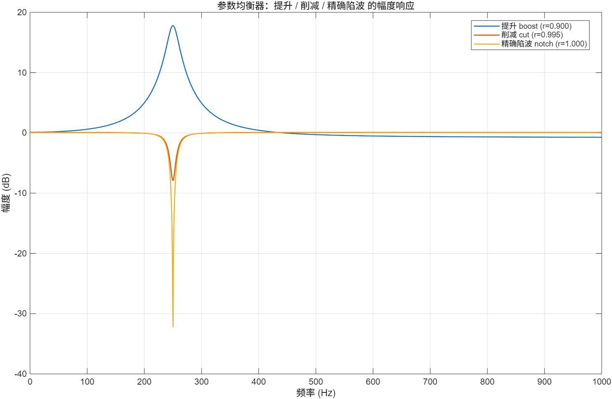
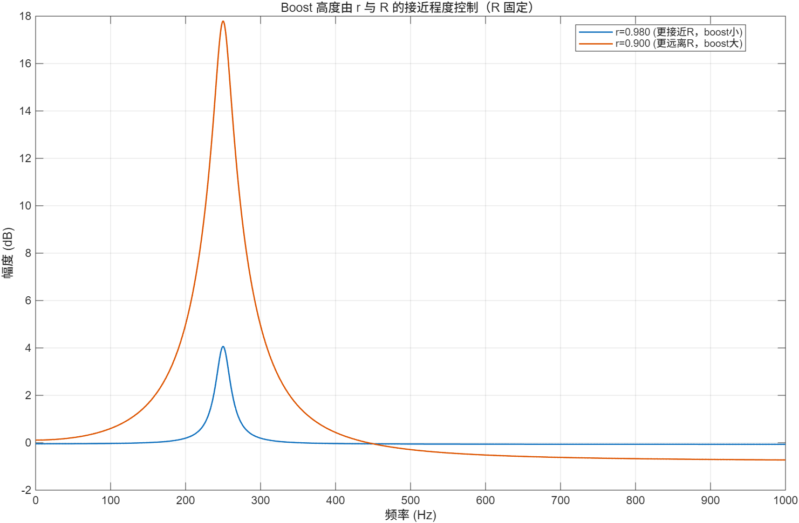
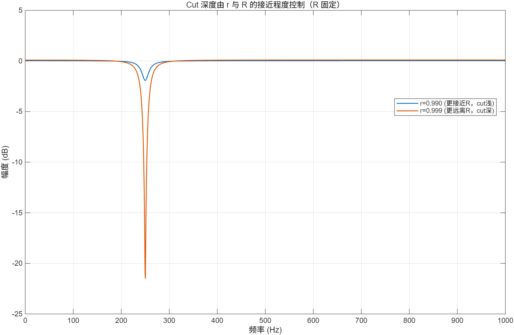
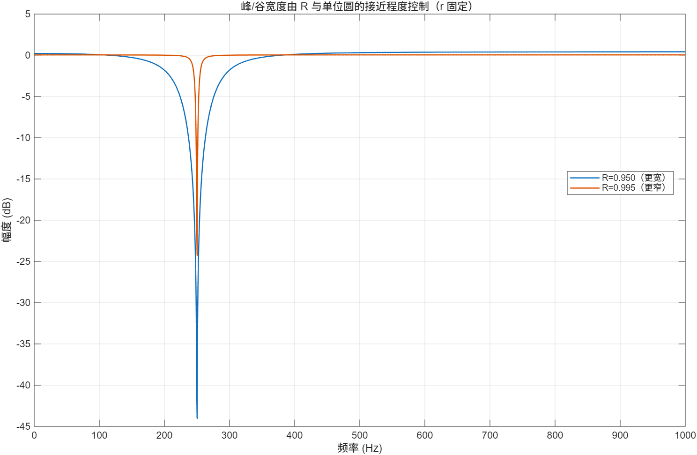
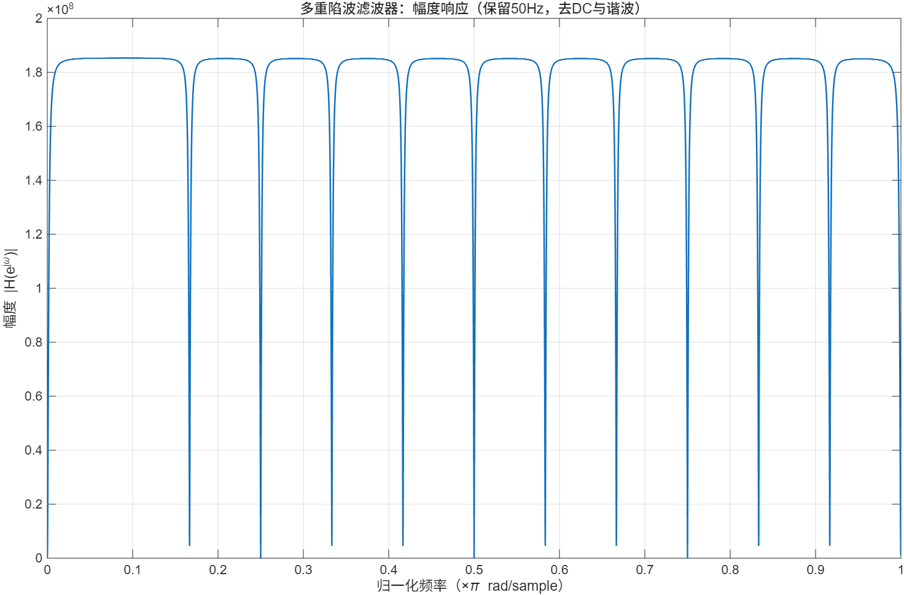
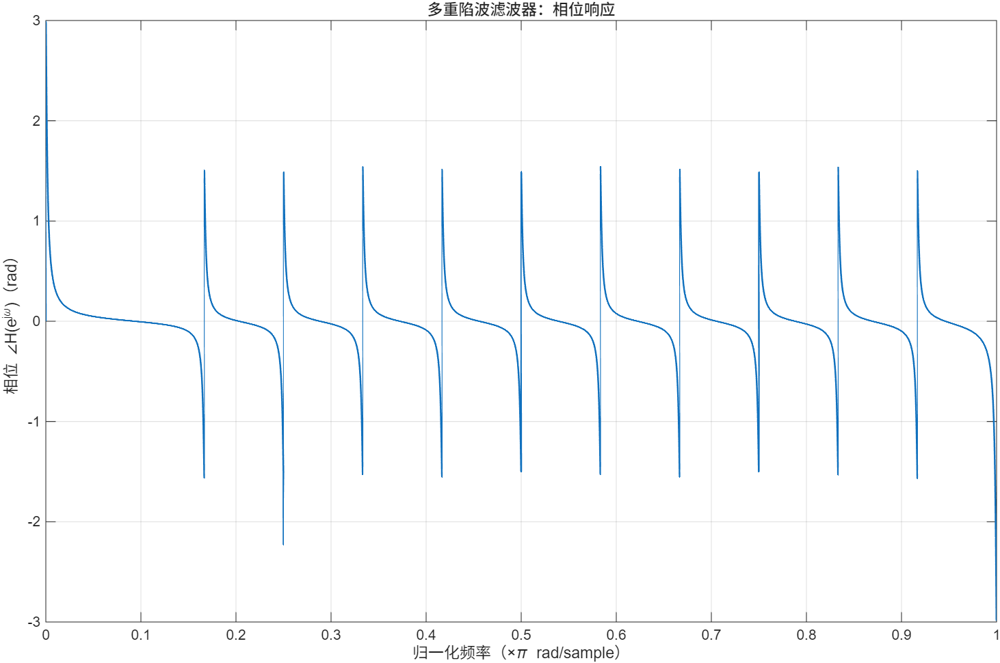
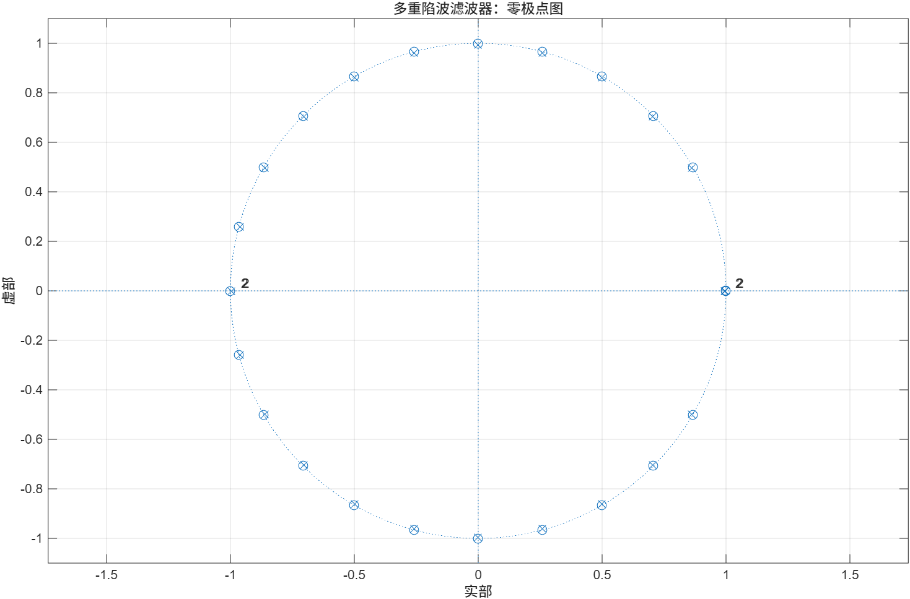

### 1.(1) 
```matlab
%% 参数
clc; clear; close all;

%% 题目参数
fs = 5000;      % 采样频率 (Hz)
f0 = 250;       % 中心频率 (Hz)
Df = 20;        % 带宽近似 (Hz)

% 数字角频率
w0 = 2*pi*f0/fs;

% 带宽 -> 极点半径
R = exp(-pi*Df/fs);

% 二阶两极点谐振器
b = 1;
a = [1, -2*R*cos(w0), R^2];

%% (1) 幅度响应
figure;
[H,f] = freqz(b, a, 4096, fs);
plot(f, 20*log10(abs(H) + 1e-12), 'LineWidth', 1.2); grid on;
title('二阶两极点谐振器：幅度响应');
xlabel('频率 (Hz)');
ylabel('幅度 (dB)');

%% (2) 冲激响应
figure;
n = 0:120;
h = impz(b, a, length(n));
stem(n, h, 'filled'); grid on;
title('二阶两极点谐振器：冲激响应');
xlabel('样本 n');
ylabel('幅度');
```



(2)

##### Parametric Equalizer 原理（固定极点、改变零点）

给定中心频率 \(f_0\)，对应数字角频率：
\[
\omega_0 = 2\pi\frac{f_0}{f_s}
\]

用一对共轭极点放在半径 \(R\)（由带宽决定）的位置：
\[
p_{1,2}=Re^{\pm j\omega_0}
\]

再放一对共轭零点在半径 \(r\)（可调）的位置：
\[
z_{1,2}=re^{\pm j\omega_0}
\]

得到二阶参数均衡器（biquad）传递函数：
\[
H(z)=\frac{1-2r\cos(\omega_0)z^{-1}+r^2z^{-2}}
          {1-2R\cos(\omega_0)z^{-1}+R^2z^{-2}}
\]

其中：
- **\(R\)** 控制“峰/谷的宽度”（\(R\to 1\) 越尖锐、带宽越窄）
- **\(r\)** 控制“峰/谷的高度”（在 \(f_0\) 附近是提升还是削减）

在中心频率 \(\omega_0\) 处，幅度满足：
\[
\left|H(e^{j\omega_0})\right|
=\left(\frac{1-r}{1-R}\right)^2
\]

因此可通过选择不同的 \(r\) 实现三种效果：

- **Boost（提升）**：取 \(r < R\)，则 \(|H(e^{j\omega_0})| > 1\)
- **Cut（削减）**：取 \(r > R\) 且 \(r<1\)，则 \(|H(e^{j\omega_0})| < 1\)
- **Exact Notch（精确陷波）**：取 \(r = 1\)，零点落在单位圆上，\(f_0\) 处幅度为 0
```matlab
clc; clear; close all;

%% 已知参数
fs = 5000;     % 采样频率
f0 = 250;      % 中心频率
Df = 20;       % 带宽(Hz)，用来确定极点半径 R

w0 = 2*pi*f0/fs;
R  = exp(-pi*Df/fs);   % 用带宽近似映射

%% 选择 3 个不同的 r：boost / cut / exact notch
r_boost = 0.90;     % r < R  -> boost（提升）
r_cut   = 0.995;    % r > R  -> cut（削减）
r_notch = 1.00;     % exact notch（精确陷波）

% 构造三个滤波器的系数
a = [1, -2*R*cos(w0), R^2];

b_boost = [1, -2*r_boost*cos(w0), r_boost^2];
b_cut   = [1, -2*r_cut*cos(w0),   r_cut^2];
b_notch = [1, -2*r_notch*cos(w0), r_notch^2];

%% 计算幅频响应
N = 4096;
[H1,f] = freqz(b_boost, a, N, fs);
H2     = freqz(b_cut,   a, N, fs);
H3     = freqz(b_notch, a, N, fs);

%% 画图
figure;
plot(f, 20*log10(abs(H1)+1e-12), 'LineWidth', 1.2); hold on;
plot(f, 20*log10(abs(H2)+1e-12), 'LineWidth', 1.2);
plot(f, 20*log10(abs(H3)+1e-12), 'LineWidth', 1.2);
grid on;

title('参数均衡器：提升 / 削减 / 精确陷波 的幅度响应');
xlabel('频率 (Hz)');
ylabel('幅度 (dB)');
legend( ...
    sprintf('提升 boost (r=%.3f)', r_boost), ...
    sprintf('削减 cut (r=%.3f)',   r_cut), ...
    sprintf('精确陷波 notch (r=%.3f)', r_notch), ...
    'Location','best');

xlim([0, 1000]);  
```



(3)

##### 结论要证明
在参数均衡器
\[
H(z)=\frac{1-2r\cos(\omega_0)z^{-1}+r^2z^{-2}}
          {1-2R\cos(\omega_0)z^{-1}+R^2z^{-2}}
\]
中，当极点半径 \(R\) 固定时，boost/cut 的“高度相对 1 的偏离程度”由 \(r\) 与 \(R\) 的接近程度决定。

##### 关键公式（中心频率处的幅度）
在 \(\omega=\omega_0\) 处有：
\[
\left|H(e^{j\omega_0})\right|
=\left(\frac{1-r}{1-R}\right)^2
\]

##### 推论
- 若 \(r<R\)：则 \((1-r)>(1-R)\Rightarrow |H(e^{j\omega_0})|>1\)，产生 **boost**。
- 若 \(r>R\) 且 \(r<1\)：则 \((1-r)<(1-R)\Rightarrow |H(e^{j\omega_0})|<1\)，产生 **cut**。
- 当 \(r\to R\) 时：
\[
\frac{1-r}{1-R}\to 1 \Rightarrow |H(e^{j\omega_0})|\to 1
\]
因此 **r 越接近 R，boost/cut 越弱；r 离 R 越远，boost/cut 越强**。
```matlab
clc; clear; close all;

%% 参数
fs = 5000;
f0 = 250;
Df = 20;

w0 = 2*pi*f0/fs;
R  = exp(-pi*Df/fs);   % 固定 R（同一带宽）

% ----------- 两组 BOOST（r<R）-----------
r_b1 = 0.98;   % 更接近 R -> boost 较小
r_b2 = 0.90;   % 更远离 R -> boost 较大

% ----------- 两组 CUT（r>R, r<1）-----------
r_c1 = 0.99;   % 略大于 R -> cut 较小（更接近 1）
r_c2 = 0.999;  % 更远离 R(更靠近1) -> cut 更深

% 传递函数系数（a 固定，b 由 r 决定）
a = [1, -2*R*cos(w0), R^2];

b_b1 = [1, -2*r_b1*cos(w0), r_b1^2];
b_b2 = [1, -2*r_b2*cos(w0), r_b2^2];

b_c1 = [1, -2*r_c1*cos(w0), r_c1^2];
b_c2 = [1, -2*r_c2*cos(w0), r_c2^2];

%% 频响
N = 4096;
[H_b1, f] = freqz(b_b1, a, N, fs);
H_b2      = freqz(b_b2, a, N, fs);
H_c1      = freqz(b_c1, a, N, fs);
H_c2      = freqz(b_c2, a, N, fs);

%% 画 BOOST 对比图
figure;
plot(f, 20*log10(abs(H_b1)+1e-12), 'LineWidth', 1.2); hold on;
plot(f, 20*log10(abs(H_b2)+1e-12), 'LineWidth', 1.2);
grid on;
title('Boost 高度由 r 与 R 的接近程度控制（R 固定）');
xlabel('频率 (Hz)'); ylabel('幅度 (dB)');
legend(sprintf('r=%.3f (更接近R，boost小)', r_b1), ...
       sprintf('r=%.3f (更远离R，boost大)', r_b2), 'Location','best');
xlim([0 1000]);

%% 画 CUT 对比图
figure;
plot(f, 20*log10(abs(H_c1)+1e-12), 'LineWidth', 1.2); hold on;
plot(f, 20*log10(abs(H_c2)+1e-12), 'LineWidth', 1.2);
grid on;
title('Cut 深度由 r 与 R 的接近程度控制（R 固定）');
xlabel('频率 (Hz)'); ylabel('幅度 (dB)');
legend(sprintf('r=%.3f (更接近R，cut浅)', r_c1), ...
       sprintf('r=%.3f (更远离R，cut深)', r_c2), 'Location','best');
xlim([0 1000]);

%% 用公式输出中心频率处的“高度”
H0 = @(r) ((1-r)/(1-R))^2;  % |H(e^{jw0})| 的闭式表达式

fprintf('R = %.6f\n', R);
fprintf('Boost: r=%.3f => |H(w0)|=%.4f (%.2f dB)\n', r_b1, H0(r_b1), 20*log10(H0(r_b1)));
fprintf('Boost: r=%.3f => |H(w0)|=%.4f (%.2f dB)\n', r_b2, H0(r_b2), 20*log10(H0(r_b2)));
fprintf('Cut  : r=%.3f => |H(w0)|=%.4f (%.2f dB)\n', r_c1, H0(r_c1), 20*log10(H0(r_c1)));
fprintf('Cut  : r=%.3f => |H(w0)|=%.4f (%.2f dB)\n', r_c2, H0(r_c2), 20*log10(H0(r_c2)));
```




(4)

##### 结论要证明
参数均衡器的峰/谷“宽度”由极点半径 R 与单位圆的接近程度控制：R 越接近 1（越靠近单位圆），峰/谷越窄越尖；R 越小，峰/谷越宽越钝。

##### 参数均衡器模型
在中心频率 ω0 处放一对共轭零点 re^(±jω0) 与一对共轭极点 Re^(±jω0)，则：
H(z) = (1 − 2r cos(ω0) z^(−1) + r^2 z^(−2)) / (1 − 2R cos(ω0) z^(−1) + R^2 z^(−2))

##### 证明思路（对比法）
设计两个参数均衡器 EQ1、EQ2：
- 两者使用相同的中心频率 ω0
- 两者使用相同的零点半径 r（保证 boost/cut 的高度一致）
- 仅改变极点半径：R1 < R2，且 R2 更接近 1

由于极点越接近单位圆，系统的阻尼越小、共振越尖锐，因此频率响应在 ω0 附近变化更集中：
- R2 更接近 1 → 峰/谷更窄（带宽更小）
- R1 更远离 1 → 峰/谷更宽（带宽更大）

对比两者的幅度响应曲线即可观察到：在相同的高度条件下，靠近单位圆的 R 对应更窄的峰/谷，从而证明“宽度由 R 与单位圆的接近程度控制”。

```matlab
clc; clear; close all;

%% 基本参数
fs = 5000;
f0 = 250;
w0 = 2*pi*f0/fs;

%% 固定 r（保证高度一致），只改变 R
r = 1.0;           % 精确陷波

R1 = 0.95;        
R2 = 0.995;         

% 构造两个滤波器
b = [1, -2*r*cos(w0), r^2];

a1 = [1, -2*R1*cos(w0), R1^2];
a2 = [1, -2*R2*cos(w0), R2^2];

%% 幅频响应
N = 4096;
[H1,f] = freqz(b, a1, N, fs);
H2     = freqz(b, a2, N, fs);

%% 画图对比宽度
figure;
plot(f, 20*log10(abs(H1)+1e-12), 'LineWidth', 1.2); hold on;
plot(f, 20*log10(abs(H2)+1e-12), 'LineWidth', 1.2);
grid on;
title('峰/谷宽度由 R 与单位圆的接近程度控制（r 固定）');
xlabel('频率 (Hz)');
ylabel('幅度 (dB)');
legend(sprintf('R=%.3f（更宽）', R1), sprintf('R=%.3f（更窄）', R2), 'Location','best');
xlim([0 1000]);     

%% 可选：用“−3 dB 宽度”粗略量化
% 以 notch 为例：找到凹陷两侧回到 (最小值+3dB) 的频率点
mag1 = 20*log10(abs(H1)+1e-12);
mag2 = 20*log10(abs(H2)+1e-12);

% 目标：相对“底部”+3dB 的宽度
min1 = min(mag1); thr1 = min1 + 3;
min2 = min(mag2); thr2 = min2 + 3;

% 找到离 f0 最近的左右交点
[~,i0] = min(abs(f - f0));

% 左侧交点
iL1 = find(mag1(1:i0) >= thr1, 1, 'last');
iR1 = i0 - 1 + find(mag1(i0:end) >= thr1, 1, 'first');

iL2 = find(mag2(1:i0) >= thr2, 1, 'last');
iR2 = i0 - 1 + find(mag2(i0:end) >= thr2, 1, 'first');

bw1 = f(iR1) - f(iL1);
bw2 = f(iR2) - f(iL2);

fprintf('Notch -3 dB 宽度估计：\n');
fprintf('R=%.3f: 约 %.2f Hz\n', R1, bw1);
fprintf('R=%.3f: 约 %.2f Hz\n', R2, bw2);
```



### 2.
（1）消除 50 Hz 工频干扰


角频率
\[
\omega_1 = \frac{2\pi \cdot 50}{1200} = \frac{\pi}{12}
\]


零点多项式
\[
N(z)=1-z^{-12}
\]
 滤波器传递函数
\[
H(z)=\frac{1-z^{-12}}{1-\rho^{-12}z^{-12}}
= \frac{1-z^{-12}}{1-Rz^{-12}}
\]

 参数选择
\[
R=0.98,\quad R^{\frac{1}{12}} = 0.990
\]


（2）消除直流分量干扰和谐波干扰

基本恒等式
\[
(1-z^{-1})(1+z^{-1})=1-z^{-2}
\]

构造分子 \(N(z)\)
\[
N(z)=\frac{1-z^{-12}}{1-z^{-2}}
= \frac{(1+z^{-6})(1-z^{-6})}{1-z^{-2}}
= (1+z^{-6})(1+z^{-2}+z^{-4})
\]


 构造传递函数
\[
H(z)=\frac{N(z)}{N(\rho^{-1}z)}
= \frac{(1+z^{-2}+z^{-4})(1+z^{-6})}
{(1+\rho^{2}z^{-2}+\rho^{4}z^{-4})(1+\rho^{6}z^{-6})}
\]


 参数关系
\[
\rho^{20}=R=0.98,\quad \rho=(0.98)^{\frac{1}{20}}
\]

```matlab
clc; clear; close all;

%  多重陷波滤波器参数
fs = 1200;     % 采样频率
f0 = 50;       % 需要保留的 50Hz
R  = 0.995;    % 极点半径：越接近1，陷波越窄，其他频率越“平”

% Nyquist = fs/2 = 600 Hz
k_all    = 0:floor((fs/2)/f0);   % 0..12
k_remove = setdiff(k_all, 1);    % 去掉 k=0,2,3,...,12；保留 k=1(50Hz)


%  构造级联滤波器 H(z)
b = 1; a = 1;

for k = k_remove
    fk = k * f0;
    wk = 2*pi*fk/fs;

    % 二阶陷波节：零点在单位圆，极点在半径R
    b_sec = [1, -2*cos(wk), 1];
    a_sec = [1, -2*R*cos(wk), R^2];

    b = conv(b, b_sec);
    a = conv(a, a_sec);
end


%  归一化：让 50Hz 处增益为 1
H50 = freqz(b, a, 1, 2*pi*f0/fs);  % 在 ω0 处求频响（数字角频率）
b = b / abs(H50);

%  计算频响
N = 8192;
[H,w] = freqz(b, a, N);       % w: rad/sample, 0..pi
wn = w/pi;                    % 归一化频率：0..1 （×π rad/sample）

mag = abs(H);                 % 幅度（线性）
ph  = angle(H);               % 相位（-pi..pi）

%  图1：幅度响应（纵轴：幅度）
figure;
plot(wn, mag, 'LineWidth', 1.2); grid on;
title('多重陷波滤波器：幅度响应（保留50Hz，去DC与谐波）');
xlabel('归一化频率（×\pi rad/sample）');
ylabel('幅度 |H(e^{j\omega})|');
xlim([0 1]);

%  图2：相位响应（纵轴：相位）
figure;
plot(wn, ph, 'LineWidth', 1.2); grid on;
title('多重陷波滤波器：相位响应');
xlabel('归一化频率（×\pi rad/sample）');
ylabel('相位 ∠H(e^{j\omega})（rad）');
xlim([0 1]);

%  图3：零极点图
figure;
zplane(b, a);
title('多重陷波滤波器：零极点图');
grid on;
```





