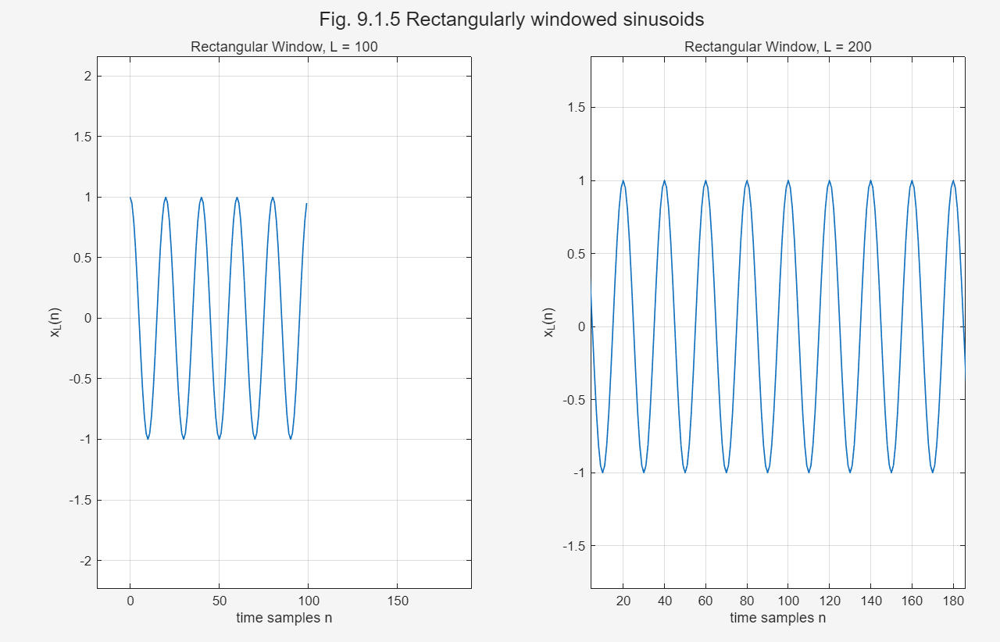
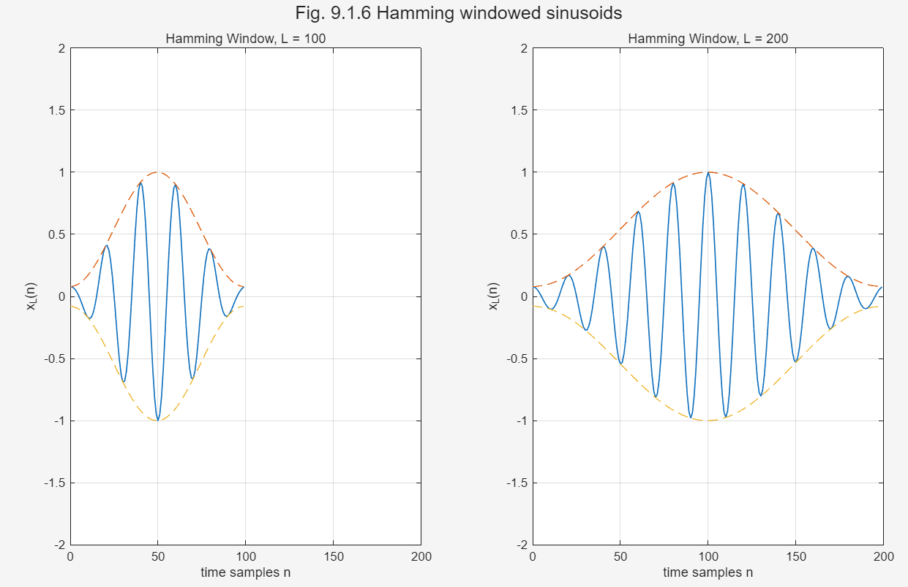
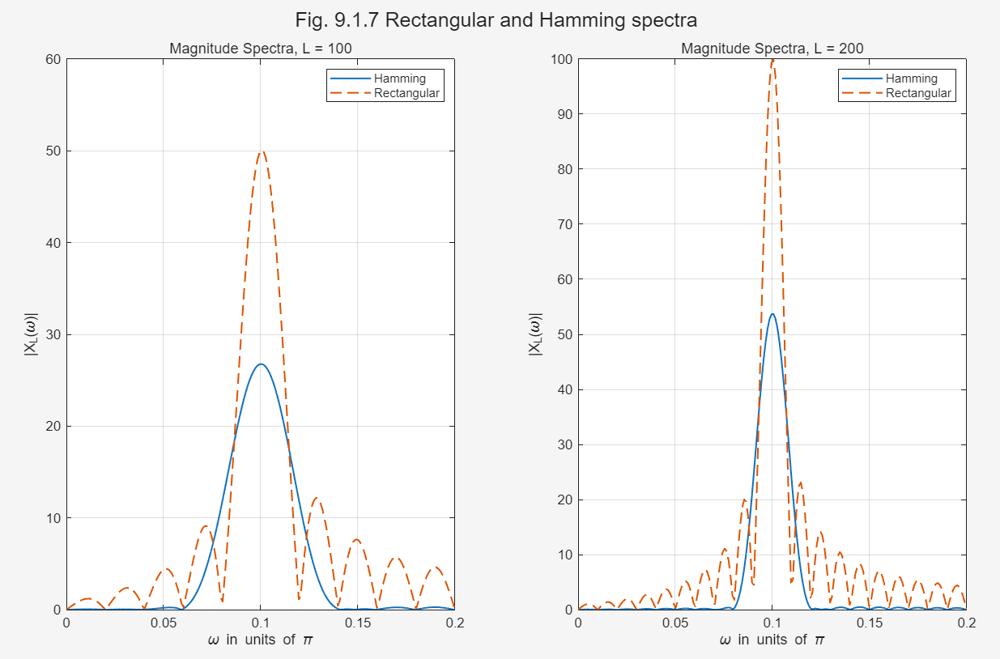
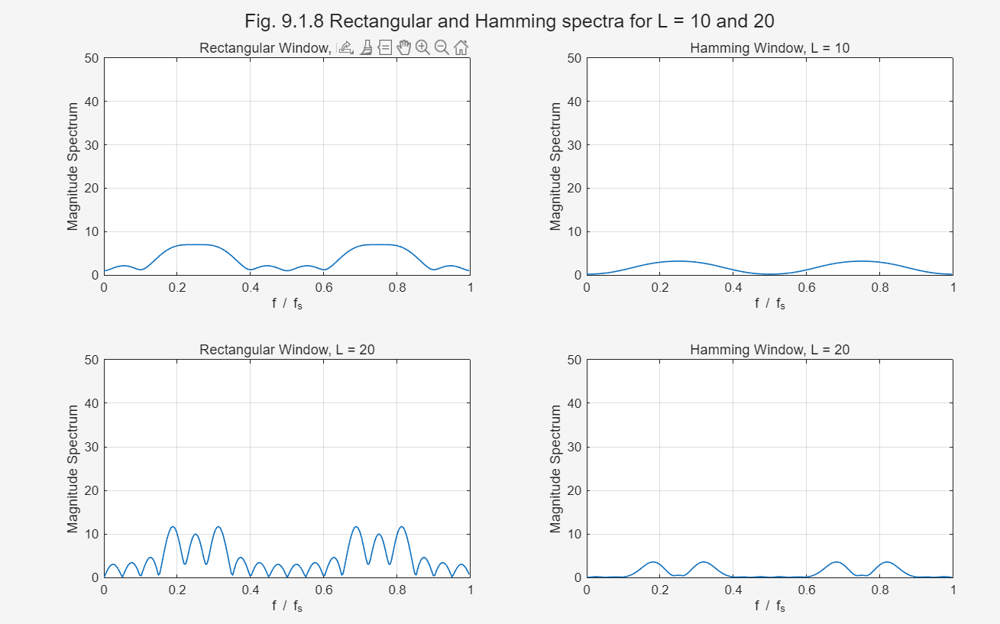
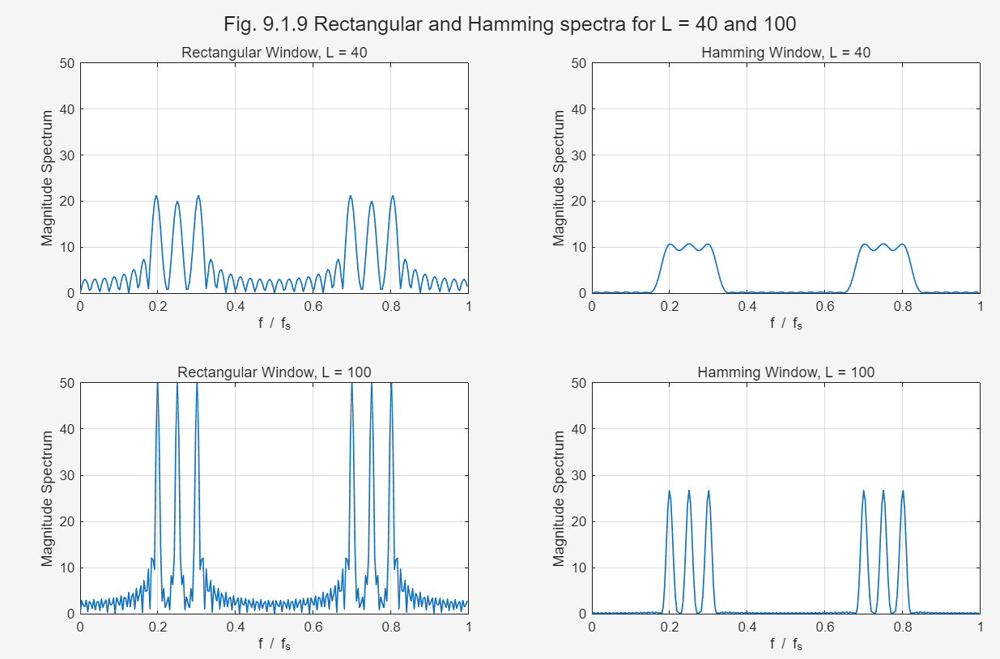

## Example 9.1.3 和 9.1.4：Windowing 对频谱的影响

### 1. 实验目的

使用 Example 9.1.3 和 Example 9.1.4 中的数据，绘制教材中的 Fig. 9.1.5 到 Fig. 9.1.9，并比较矩形窗和 Hamming 窗对频谱的影响。

主要观察内容包括：

1. 矩形窗和 Hamming 窗在时域上的差别；
2. 数据长度 \(L\) 对频率分辨率的影响；
3. 矩形窗和 Hamming 窗在频域中的主瓣宽度和旁瓣高度；
4. windowing 对频谱泄漏和频率分辨率的影响。

---

## 2. MATLAB 代码

```matlab
clear; clc; close all;

%% =========================
% Example 9.1.3
% x(t)=cos(2*pi*f0*t)
% f0=50 Hz, fs=1000 Hz
% omega0 = 2*pi*f0/fs = 0.1*pi
%% =========================

fs = 1000;
f0 = 50;
omega0 = 2*pi*f0/fs;

L_list = [100 200];

%% Fig. 9.1.5 Rectangular windowed sinusoids
figure;
for i = 1:length(L_list)
    L = L_list(i);
    n = 0:L-1;
    x = cos(omega0*n);
    
    subplot(1,2,i);
    plot(n, x, 'LineWidth', 1);
    grid on;
    ylim([-2 2]);
    xlim([0 200]);
    title(['Rectangular Window, L = ', num2str(L)]);
    xlabel('time samples n');
    ylabel('x_L(n)');
end
sgtitle('Fig. 9.1.5 Rectangularly windowed sinusoids');

%% Fig. 9.1.6 Hamming windowed sinusoids
figure;
for i = 1:length(L_list)
    L = L_list(i);
    n = 0:L-1;
    
    w_ham = 0.54 - 0.46*cos(2*pi*n/(L-1));
    x = w_ham .* cos(omega0*n);
    
    subplot(1,2,i);
    plot(n, x, 'LineWidth', 1);
    hold on;
    plot(n, w_ham, '--');
    plot(n, -w_ham, '--');
    grid on;
    ylim([-2 2]);
    xlim([0 200]);
    title(['Hamming Window, L = ', num2str(L)]);
    xlabel('time samples n');
    ylabel('x_L(n)');
end
sgtitle('Fig. 9.1.6 Hamming windowed sinusoids');

%% Fig. 9.1.7 Spectra of rectangular and Hamming windows
Nw = 200;
omega = linspace(0, 0.2*pi, Nw);

figure;
for i = 1:length(L_list)
    L = L_list(i);
    n = 0:L-1;
    
    x_rect = cos(omega0*n);
    w_ham = 0.54 - 0.46*cos(2*pi*n/(L-1));
    x_ham = w_ham .* cos(omega0*n);
    
    X_rect = zeros(size(omega));
    X_ham = zeros(size(omega));
    
    for k = 1:length(omega)
        X_rect(k) = sum(x_rect .* exp(-1j*omega(k)*n));
        X_ham(k) = sum(x_ham .* exp(-1j*omega(k)*n));
    end
    
    subplot(1,2,i);
    plot(omega/pi, abs(X_ham), 'LineWidth', 1.2);
    hold on;
    plot(omega/pi, abs(X_rect), '--', 'LineWidth', 1.2);
    grid on;
    legend('Hamming', 'Rectangular');
    xlabel('\omega in units of \pi');
    ylabel('|X_L(\omega)|');
    title(['Magnitude Spectra, L = ', num2str(L)]);
end
sgtitle('Fig. 9.1.7 Rectangular and Hamming spectra');


%% =========================
% Example 9.1.4
% x(t)=cos(2*pi*f1*t)+cos(2*pi*f2*t)+cos(2*pi*f3*t)
% f1=2 kHz, f2=2.5 kHz, f3=3 kHz
% fs=10 kHz
%% =========================

fs = 10000;
f1 = 2000;
f2 = 2500;
f3 = 3000;

L_list = [10 20 40 100];
Nfft = 256;

%% Fig. 9.1.8 L = 10 and 20
figure;
plot_count = 1;

for L = [10 20]
    n = 0:L-1;
    
    x = cos(2*pi*f1*n/fs) + ...
        cos(2*pi*f2*n/fs) + ...
        cos(2*pi*f3*n/fs);
    
    w_rect = ones(1,L);
    w_ham = 0.54 - 0.46*cos(2*pi*n/(L-1));
    
    x_rect = x .* w_rect;
    x_ham = x .* w_ham;
    
    X_rect = fft(x_rect, Nfft);
    X_ham = fft(x_ham, Nfft);
    
    f_axis = (0:Nfft-1)/Nfft;
    
    subplot(2,2,plot_count);
    plot(f_axis, abs(X_rect), 'LineWidth', 1);
    grid on;
    ylim([0 50]);
    title(['Rectangular Window, L = ', num2str(L)]);
    xlabel('f / f_s');
    ylabel('Magnitude Spectrum');
    plot_count = plot_count + 1;
    
    subplot(2,2,plot_count);
    plot(f_axis, abs(X_ham), 'LineWidth', 1);
    grid on;
    ylim([0 50]);
    title(['Hamming Window, L = ', num2str(L)]);
    xlabel('f / f_s');
    ylabel('Magnitude Spectrum');
    plot_count = plot_count + 1;
end

sgtitle('Fig. 9.1.8 Rectangular and Hamming spectra for L = 10 and 20');


%% Fig. 9.1.9 L = 40 and 100
figure;
plot_count = 1;

for L = [40 100]
    n = 0:L-1;
    
    x = cos(2*pi*f1*n/fs) + ...
        cos(2*pi*f2*n/fs) + ...
        cos(2*pi*f3*n/fs);
    
    w_rect = ones(1,L);
    w_ham = 0.54 - 0.46*cos(2*pi*n/(L-1));
    
    x_rect = x .* w_rect;
    x_ham = x .* w_ham;
    
    X_rect = fft(x_rect, Nfft);
    X_ham = fft(x_ham, Nfft);
    
    f_axis = (0:Nfft-1)/Nfft;
    
    subplot(2,2,plot_count);
    plot(f_axis, abs(X_rect), 'LineWidth', 1);
    grid on;
    ylim([0 50]);
    title(['Rectangular Window, L = ', num2str(L)]);
    xlabel('f / f_s');
    ylabel('Magnitude Spectrum');
    plot_count = plot_count + 1;
    
    subplot(2,2,plot_count);
    plot(f_axis, abs(X_ham), 'LineWidth', 1);
    grid on;
    ylim([0 50]);
    title(['Hamming Window, L = ', num2str(L)]);
    xlabel('f / f_s');
    ylabel('Magnitude Spectrum');
    plot_count = plot_count + 1;
end

sgtitle('Fig. 9.1.9 Rectangular and Hamming spectra for L = 40 and 100');
``` 








## 3. Example 9.1.3 分析

### 3.1 信号参数

Example 9.1.3 中的连续时间信号为：

x(t) = cos(2πf0t)

其中：

f0 = 50 Hz

采样频率为：

fs = 1 kHz = 1000 Hz

所以离散时间角频率为：

ω0 = 2πf0 / fs

代入数值：

ω0 = 2π × 50 / 1000 = 0.1π

因此离散信号为：

x(n) = cos(ω0n) = cos(0.1πn)

---

### 3.2 矩形窗截断

矩形窗相当于直接截取长度为 L 的信号：

xL(n) = wrec(n)x(n)

其中：

wrec(n) = 1，0 ≤ n ≤ L - 1

所以：

xL(n) = cos(ω0n)，0 ≤ n ≤ L - 1

矩形窗的特点是信号在截断边界处突然开始、突然结束。

因此，矩形窗可以理解为一种“硬截断”。

---

### 3.3 Hamming 窗截断

Hamming 窗为：

wham(n) = 0.54 - 0.46cos(2πn / (L - 1))

加窗后的信号为：

xL(n) = wham(n)x(n)

即：

xL(n) = [0.54 - 0.46cos(2πn / (L - 1))]cos(ω0n)

Hamming 窗会让信号两端逐渐变小，中间较大。

因此，Hamming 窗可以理解为一种“软截断”。

---

## 4. Fig. 9.1.5 和 Fig. 9.1.6 的比较

### 4.1 Fig. 9.1.5：矩形窗时域波形

Fig. 9.1.5 画的是矩形窗截断后的正弦信号。

当 L = 100 时，信号只保留前 100 个采样点。

当 L = 200 时，信号保留前 200 个采样点。

由于矩形窗不改变信号内部的幅度，所以波形幅度基本保持在 [-1, 1] 之间。

---

### 4.2 Fig. 9.1.6：Hamming 窗时域波形

Fig. 9.1.6 画的是 Hamming 窗截断后的正弦信号。

Hamming 窗会给原始正弦信号乘上一个平滑包络。

所以信号两端幅度较小，中间幅度较大。

与矩形窗相比，Hamming 窗减少了边界处的突变。

---

## 5. Fig. 9.1.7 频谱比较

### 5.1 数据长度 L 对频谱的影响

从 Fig. 9.1.7 可以看出，当 L 从 100 增加到 200 时，无论是矩形窗还是 Hamming 窗，频谱主瓣都会变窄。

原因是观察时间变长，频率分辨率提高。

频率分辨率大致满足：

Δf ≈ fs / L

所以 L 越大，Δf 越小，越容易分辨相邻频率成分。

---

### 5.2 矩形窗的频谱特点

矩形窗的主瓣比较窄，所以频率分辨率较高。

但是矩形窗的旁瓣较高，频谱泄漏比较严重。

因此，矩形窗频谱中主峰附近会出现比较明显的波纹。

这些波纹就是旁瓣，也就是 sidelobes。

---

### 5.3 Hamming 窗的频谱特点

Hamming 窗的主瓣比矩形窗宽。

所以它的频率分辨率比矩形窗低。

但是 Hamming 窗的旁瓣比矩形窗低得多，因此频谱泄漏更小。

所以 Hamming 窗适合用于需要抑制频谱泄漏的场合。

---

## 6. Example 9.1.4 分析

### 6.1 信号参数

Example 9.1.4 中的信号由三个等幅正弦信号组成：

x(t) = cos(2πf1t) + cos(2πf2t) + cos(2πf3t)

其中：

f1 = 2 kHz

f2 = 2.5 kHz

f3 = 3 kHz

采样频率为：

fs = 10 kHz

对应的归一化频率分别为：

f1 / fs = 0.2

f2 / fs = 0.25

f3 / fs = 0.3

由于信号是实信号，所以频谱中同时存在正频率和负频率。

在 DFT 频率轴 0 ≤ f / fs ≤ 1 上，正频率峰出现在：

0.2，0.25，0.3

对应的负频率峰出现在：

1 - 0.2 = 0.8

1 - 0.25 = 0.75

1 - 0.3 = 0.7

所以频谱右半部分还会出现三个对应的峰：

0.7，0.75，0.8

---

### 6.2 最小频率间隔

三个频率中，相邻频率间隔为：

Δf = 2.5 - 2 = 0.5 kHz

或者：

Δf = 3 - 2.5 = 0.5 kHz

所以最小频率间隔为：

Δf = 0.5 kHz

根据频率分辨率近似关系：

Δf ≈ fs / L

要分辨间隔为 0.5 kHz 的频率成分，需要：

L ≈ fs / Δf

代入数值：

L ≈ 10 / 0.5 = 20

因此，理论上最小数据长度约为：

L = 20

---

## 7. Fig. 9.1.8 和 Fig. 9.1.9 的结果分析

### 7.1 当 L = 10 时

当 L = 10 时，数据长度太短。

频率分辨率为：

Δf ≈ fs / L = 10 / 10 = 1 kHz

但是三个正弦信号之间的间隔只有：

0.5 kHz

所以频率分辨率不够，三个频率成分不能被分开。

在频谱图中，三个峰会合并成一个较宽的峰。

---

### 7.2 当 L = 20 时

当 L = 20 时：

Δf ≈ fs / L = 10 / 20 = 0.5 kHz

这刚好等于三个正弦信号之间的频率间隔。

因此，矩形窗开始能够分辨三个频率峰。

但是 Hamming 窗因为主瓣更宽，所以在 L = 20 时分辨效果仍然不够明显。

---

### 7.3 当 L = 40 时

当 L = 40 时：

Δf ≈ fs / L = 10 / 40 = 0.25 kHz

此时频率分辨率已经优于频率间隔 0.5 kHz。

所以三个频率成分开始比较清楚地分离。

矩形窗的三个峰更加尖锐，但是旁瓣较明显。

Hamming 窗的旁瓣较低，但是峰更宽。

---

### 7.4 当 L = 100 时

当 L = 100 时：

Δf ≈ fs / L = 10 / 100 = 0.1 kHz

此时频率分辨率很高。

无论是矩形窗还是 Hamming 窗，都可以清楚地区分三个频率成分。

但是二者仍然有区别：

矩形窗的峰更窄，但旁瓣更明显；

Hamming 窗的峰更宽，但旁瓣更低，频谱泄漏更小。

---

## 8. Windowing 的影响总结

### 8.1 窗函数的本质作用

对有限长度信号进行频谱分析时，实际上一定会对信号进行截断。

截断相当于在时域中乘以一个窗函数：

xL(n) = x(n)w(n)

根据傅里叶变换性质，时域相乘对应频域卷积。

所以加窗会改变信号的频谱形状。

---

### 8.2 矩形窗的特点

矩形窗的优点是主瓣窄，因此频率分辨率较高。

但是矩形窗的缺点是旁瓣较高，因此频谱泄漏较严重。

所以矩形窗适合用于分辨频率间隔较小的信号，但不适合用于抑制泄漏。

---

### 8.3 Hamming 窗的特点

Hamming 窗的优点是旁瓣较低，因此可以有效抑制频谱泄漏。

但是 Hamming 窗的缺点是主瓣较宽，因此频率分辨率较低。

所以 Hamming 窗适合用于降低旁瓣干扰，但不适合在数据长度较短时分辨非常接近的频率成分。

---

## 9. 最终结论

Windowing 的核心影响可以概括为：

**矩形窗分辨率高但泄漏严重；Hamming 窗泄漏小但分辨率较低。**

具体结论如下：

1. 数据长度 L 越大，观察时间越长，频率分辨率越高；
2. L 越大，频谱主瓣越窄，相邻频率越容易被分开；
3. 矩形窗主瓣窄，因此分辨率较高；
4. 矩形窗旁瓣高，因此频谱泄漏较严重；
5. Hamming 窗主瓣宽，因此分辨率较低；
6. Hamming 窗旁瓣低，因此频谱泄漏较小；
7. 当 L = 10 时，三个频率分量无法分开；
8. 当 L = 20 时，矩形窗开始分辨三个峰，但 Hamming 窗仍较困难；
9. 当 L = 40 时，三个峰开始明显分离；
10. 当 L = 100 时，两种窗都可以清楚分辨三个频率峰；
11. 选择窗函数时，本质上是在频率分辨率和频谱泄漏之间做折中。