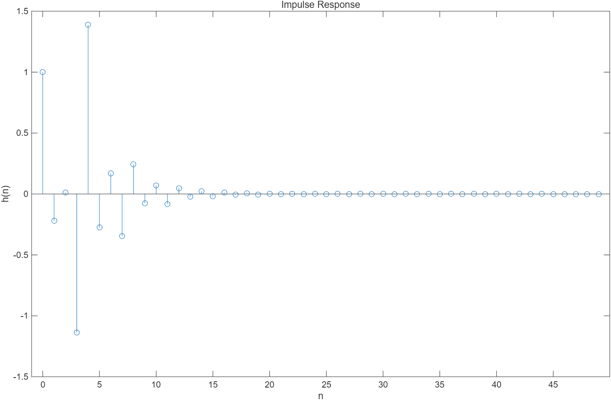
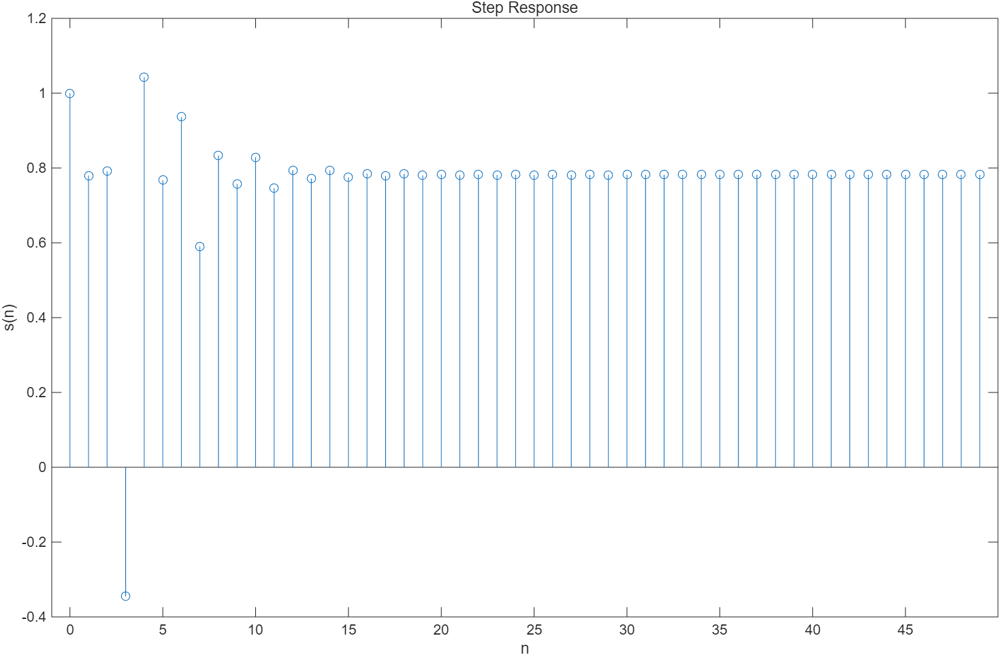
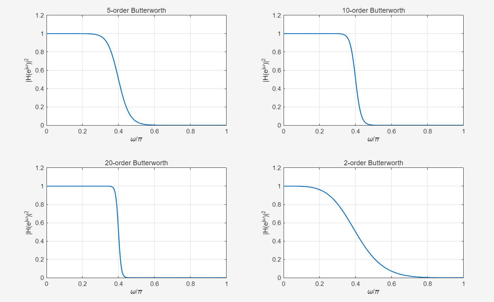
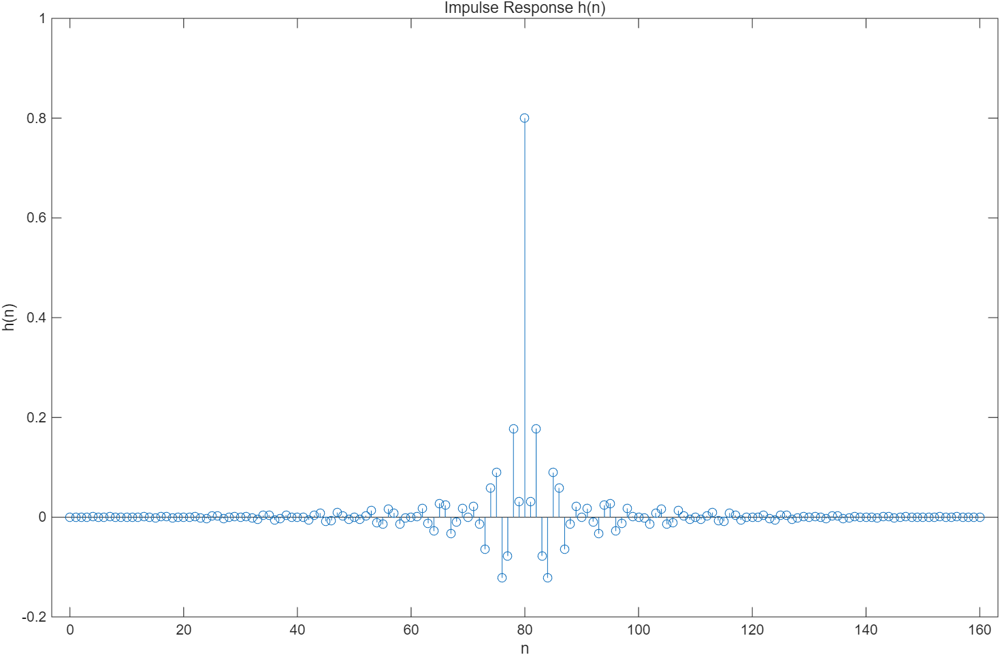
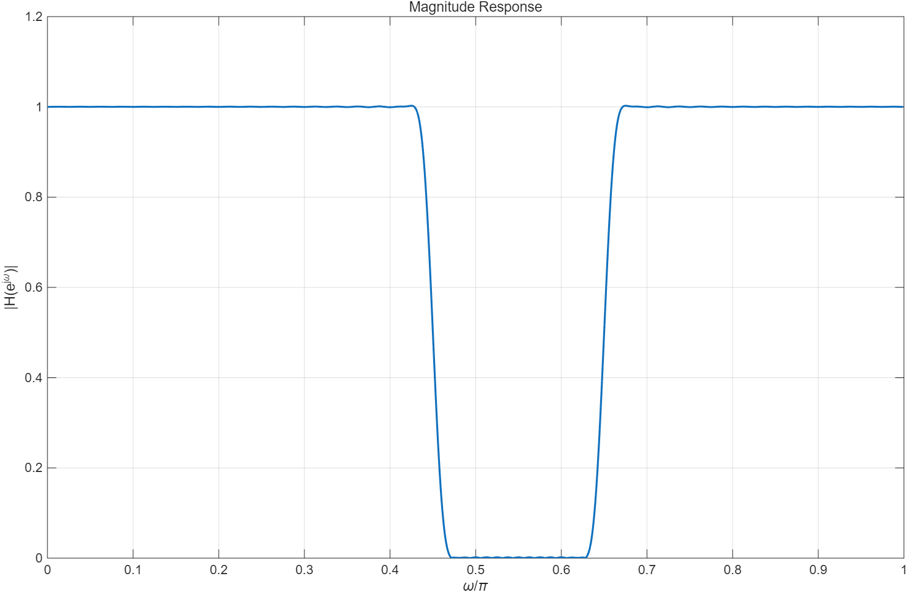

# 1.

\[
H(z)=\frac{1-az^{-1}+bz^{-2}-cz^{-3}+dz^{-4}}
{1+0.22z^{-1}+0.037z^{-2}+0.142z^{-3}-0.107z^{-4}-0.013z^{-5}}
\]


# matlab代码

```matlab
clc;
clear;
close all;

% 学号最后四位
a1 = 0;
b1 = 0;
c1 = 1;
d1 = 1;

b = [1 -a1 b1 -c1 d1];
a = [1 0.22 0.037 0.142 -0.107 -0.013];

N = 50;

%% impulse response
x = [1 zeros(1,N-1)];
h = filter(b,a,x);

figure;
stem(0:N-1,h);
title('Impulse Response');
xlabel('n');
ylabel('h(n)');

%% step response
u = ones(1,N);
s = filter(b,a,u);

figure;
stem(0:N-1,s);
title('Step Response');
xlabel('n');
ylabel('s(n)');
```




# 2.

# matlab代码

```matlab
clc;
clear;
close all;

orders = [5 10 20 2];
Wn = 0.4;

figure;

for k = 1:length(orders)

    n = orders(k);

    [b,a] = butter(n,Wn);

    [H,w] = freqz(b,a,1024);

    subplot(2,2,k);

    plot(w/pi,abs(H).^2,'LineWidth',1.5);

    grid on;

    title([num2str(n) '-order Butterworth']);

    xlabel('\omega/\pi');

    ylabel('|H(e^{j\omega})|^2');

end
```




# 3. 

## 3.1 设计指标

FIR 带阻滤波器的设计指标如下。

### 通带

\[
0 \sim 0.4\pi
\]

以及

\[
0.7\pi \sim \pi
\]

### 阻带

\[
0.45\pi \sim 0.65\pi
\]

### 过渡带

两侧的过渡带宽度为：

\[
\Delta\omega = 0.05\pi
\]

### 波纹与衰减要求

通带波纹：

\[
A_{pass}=0.5\text{ dB}
\]

阻带衰减：

\[
A_{stop}=41\text{ dB}
\]


## 3.2 使用窗函数法设计 FIR 滤波器

在本实验中，采用窗函数法设计 FIR 带阻滤波器。

可选的窗函数包括：

- 矩形窗（Rectangular window）
- 汉宁窗（Hanning window）
- 汉明窗（Hamming window）

不同窗函数的阻带衰减性能如下表所示：

| 窗函数 | 阻带衰减 |
|------|------|
| 矩形窗 | 21 dB |
| 汉宁窗 | 44 dB |
| 汉明窗 | 53 dB |

由于本设计要求的阻带衰减为：

\[
A_{stop}=41\text{ dB}
\]

因此选择**Hamming window**，因为它既能满足阻带衰减要求，同时具有较好的频率响应特性。


## 3.3 滤波器阶数估计

对于汉明窗，滤波器阶数可近似估计为：

\[
N \approx \frac{8\pi}{\Delta\omega}
\]

其中：

\[
\Delta\omega = 0.05\pi
\]

代入计算：

\[
N \approx \frac{8\pi}{0.05\pi}
\]

\[
N \approx 160
\]

因此选择滤波器阶数为：

\[
N = 160
\]


## 3.4 MATLAB 程序

```matlab
clc;
clear;
close all;

N = 160;

wc1 = 0.45;
wc2 = 0.65;

b = fir1(N,[wc1 wc2],'stop',hamming(N+1));

%% impulse response

figure;
stem(0:N,b);

title('Impulse Response h(n)');
xlabel('n');
ylabel('h(n)');

%% frequency response

[H,w] = freqz(b,1,1024);

figure;

plot(w/pi,abs(H),'LineWidth',1.5);

grid on;

title('Magnitude Response');

xlabel('\omega/\pi');

ylabel('|H(e^{j\omega})|');
```



