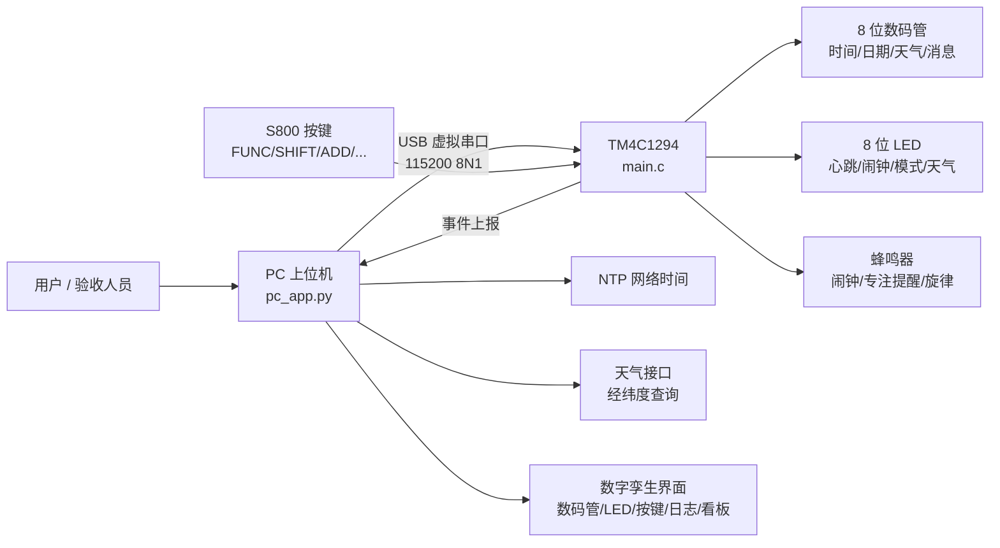
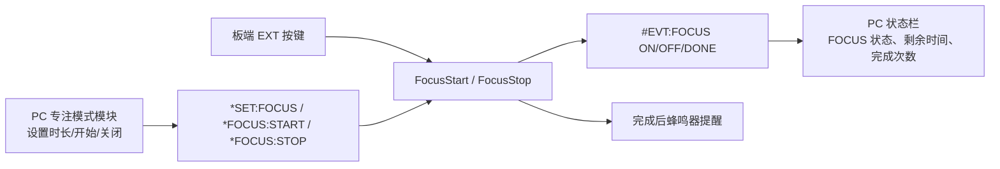
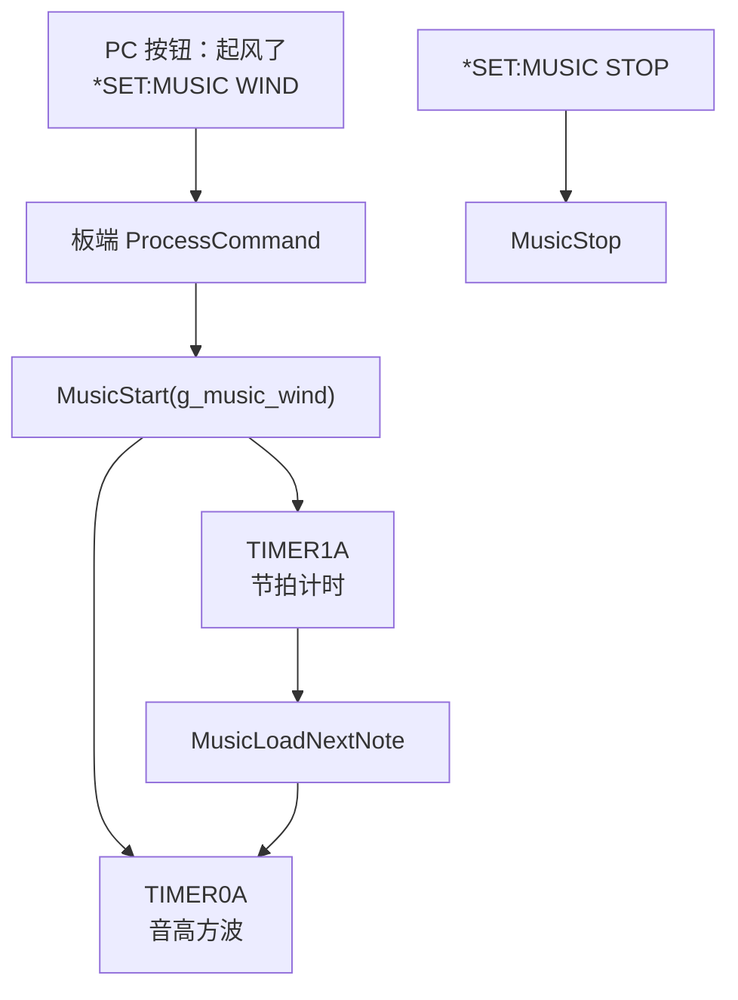
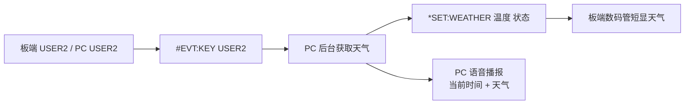

# S800 智能联网时钟系统简介

学生：姜圣基  
学号：523170910011  
开发平台：TI TM4C1294 LaunchPad + S800 扩展板  
开发工具：Keil MDK 5、TivaWare / DriverLib、Python Tkinter、pyserial  
上位机环境：Windows + Python 3  

## 1. 项目概述

本项目基于 TM4C1294 LaunchPad 和 S800 实验扩展板，实现一个“板端时钟 + PC 数字孪生 + 联网扩展”的智能联网时钟系统。板端负责数码管显示、按键交互、闹钟、流水显示、LED 状态提示和蜂鸣器输出；PC 上位机通过 USB 虚拟串口与开发板通信，实现远程控制、状态镜像、网络对时、天气获取、自动昼夜模式、数据看板和音乐蜂鸣器等功能。

项目遵循课程要求：自编 MCU 应用代码集中在 `mcu/src/main.c`，PC 上位机主程序为 `pc_host/pc_app.py`，并保留 Keil 工程和可烧录产物。

## 2. 系统总体框图



系统采用“板端实时控制 + PC 联网增强”的分工。板端脱离 PC 后仍可完成基础时钟、日期、闹钟和按键编辑；PC 连接后提供联网、可视化和演示增强能力。

## 3. 工程目录结构

```text
大作业-523170910011-姜圣基/
├─ mcu/
│  ├─ Inc/                    共用头文件
│  ├─ Driverlib/              TivaWare / DriverLib，保留原样
│  ├─ RTE/                    Keil RTE 启动文件
│  ├─ src/
│  │  └─ main.c               自编 MCU 应用代码集中于此
│  ├─ obj/
│  │  ├─ S800_NetworkClock_JIANGSJ.axf
│  │  └─ S800_NetworkClock_JIANGSJ.hex
│  └─ S800_NetworkClock.uvprojx
├─ pc_host/
│  ├─ pc_app.py               PC 上位机源代码
│  └─ requirements.txt
├─ docs/
│  └─ 大作业-523170910011-姜圣基_简介.md
└─ README.md                  编译 / 运行说明
```

## 4. 已实现功能

### 4.1 板端基础功能

板端完成课程基础要求中的数码管显示、日期时间显示、流水消息、闹钟、编辑状态机、LED 辅助指示等功能。按键既支持物理 S800 按键，也支持 PC 端通过串口模拟按键。

主要状态包括：

| 模块 | 实现效果 |
|---|---|
| 开机画面 | 依次显示学号、姓名拼音编码、版本信息，并同步到数字镜像 |
| 时钟 / 日期 | 默认北京时间 UTC+8，支持时间、日期独立设置 |
| 闹钟 | 支持时分秒闹钟，触发后蜂鸣器响铃、LED 指示 |
| 编辑状态机 | FUNC/SHIFT/ADD/SAVE 等按键完成字段选择和修改 |
| 流水显示 | 支持自定义消息、小数点、方向和速度控制 |
| LED 状态 | 系统心跳、闹钟启用、响铃、编辑、串口活动、显示方向等 |

LED 状态定义如下：

| LED | 位值 | 基础含义 | 扩展复用 |
|---|---|---|---|
| LED1 | `0x01` | 系统心跳，约 0.5 秒翻转一次 | NIGHT 模式下保留心跳 |
| LED2 | `0x02` | 闹钟已启用 | 无 |
| LED3 | `0x04` | 闹钟正在响铃 | 无 |
| LED4 | `0x08` | 编辑模式 | 网络对时成功后短时点亮 |
| LED5 | `0x10` | 串口收发活动 | 无 |
| LED6 | `0x20` | FORMAT RIGHT 状态 | 天气晴 SUN 指示 |
| LED7 | `0x40` | DISPLAY OFF 状态 | 天气雨 RAIN 指示 |
| LED8 | `0x80` | 流水显示内容超过 8 位 | 天气高温 HOT 指示 |

通过 LED 可以快速观察系统当前状态：LED1 用于确认程序仍在运行，LED2/LED3 用于判断闹钟是否启用或正在响铃，LED4 辅助观察编辑和网络对时，LED5 反映串口通信活动，LED6-LED8 则用于显示方向、熄屏和天气等扩展状态。

### 4.2 串口协议与数字孪生

PC 和板端之间使用 USB 虚拟串口通信。协议支持 `*SET`、`*GET`、`*PING` 和事件上报，具备大小写、空格、Tab 容错能力。

常用事件如下：

```text
#PONG <uptime_s>
#EVT:DISP <8字符> <dpHex>
#EVT:LED <hex2>
#EVT:KEY <NAME>
#EVT:MODE DAY/NIGHT
#EVT:FOCUS ON/OFF/DONE ...
#EVT:MUSIC ON/OFF
```

PC 上位机实现了 8 位七段数码管、8 位 LED、10 个虚拟按键、状态栏、控制面板、日志和数据看板。板端每次显示或 LED 状态变化时主动上报事件，PC 端据此更新数字镜像。

### 4.3 联网扩展功能

| 扩展 | 功能说明 |
|---|---|
| E1 网络对时 | PC 从 NTP 获取标准时间，转换为北京时间后下发板端 |
| E2 天气获取 | 根据默认经纬度获取天气，USER2 可触发天气短显和语音播报 |
| E3 自动昼夜模式 | PC 计算当地日出日落，自动下发 DAY/NIGHT 模式 |
| E4 数据可视化看板 | 持久化记录闹钟、对时、按键、模式、天气、专注、错误等事件，并绘图展示 |
| E5 音乐蜂鸣器 | 通过定时器软件翻转 GPIO，播放“起风了”简谱旋律 |

## 5. 关键代码片段

### 5.1 专注模式倒计时与完成提醒

代码位置：`mcu/src/main.c`，`FocusStart()`、`FocusStop()`、`FocusUpdate()`。

```c
static void FocusStart(void)
{
    g_focus_active = true;
    g_focus_remaining_seconds = (uint32_t)g_focus_duration_minutes * 60U;
    SendDisplayEvent();
    SendFocusEvent("ON");
}

static void FocusStop(bool completed)
{
    g_focus_active = false;
    g_focus_remaining_seconds = 0U;
    if (completed) {
        g_focus_completed_count++;
        MusicStop();
        g_manual_beep_until_ms = g_milliseconds + FOCUS_BEEP_MS;
        BuzzerTone(BUZZER_DEFAULT_FREQ_HZ);
        BuzzerSet(true);
        SendDisplayEvent();
        SendFocusEvent("DONE");
    } else {
        SendDisplayEvent();
        SendFocusEvent("OFF");
    }
}
```

设计要点：专注模式不改变正常时钟显示，倒计时状态通过串口事件同步到 PC 状态栏。倒计时完成后使用普通蜂鸣器提醒，并累计完成次数。

### 5.2 音乐蜂鸣器的双定时器方案

代码位置：`mcu/src/main.c`，`TIMER0A_Handler()`、`TIMER1A_Handler()`。

```c
void TIMER0A_Handler(void)
{
    TimerIntClear(TIMER0_BASE, TIMER_TIMA_TIMEOUT);
    if (g_buzzer_enabled) {
        g_buzzer_level = !g_buzzer_level;
        GPIOPinWrite(BUZZER_GPIO_BASE, BUZZER_GPIO_PIN,
                     g_buzzer_level ? BUZZER_GPIO_PIN : 0U);
    } else {
        GPIOPinWrite(BUZZER_GPIO_BASE, BUZZER_GPIO_PIN, 0U);
    }
}

void TIMER1A_Handler(void)
{
    TimerIntClear(TIMER1_BASE, TIMER_TIMA_TIMEOUT);
    if (!g_music_active) {
        TimerDisable(TIMER1_BASE, TIMER_A);
        return;
    }
    g_music_note_elapsed_ms++;
    if (g_music_note_elapsed_ms >= g_music_note_duration_ms) {
        MusicLoadNextNote();
    }
}
```

设计要点：`TIMER0A` 负责音高，按目标频率翻转蜂鸣器 GPIO；`TIMER1A` 负责节拍，每 1ms 累计音符时长并切换下一个音符。这样避免把音乐节拍塞进主循环，减少对显示刷新和串口解析的影响。

### 5.3 PC 网络对时

代码位置：`pc_host/pc_app.py`，`sync_ntp_worker()`、`query_ntp_time()`。

```python
def sync_ntp_worker(self):
    ntp_time = self.query_ntp_time()
    now = datetime.fromtimestamp(ntp_time, tz=timezone.utc) + timedelta(hours=8)
    date_cmd = f"*SET:DATE YEAR MONTH DATE {now.year:04d} {now.month:02d} {now.day:02d}"
    time_cmd = f"*SET:TIME HOUR MIN SEC {now.hour:02d} {now.minute:02d} {now.second:02d}"
    self.root.after(0, lambda: self.send(date_cmd))
    self.root.after(80, lambda: self.send(time_cmd))
    self.root.after(160, lambda: self.send("*SET:SYNC OK"))
```

设计要点：PC 端负责网络访问和 UTC+8 转换，板端只接收最终日期时间，降低 MCU 网络复杂度。下发时间和日期之间加入短延迟，避免串口命令粘连。

### 5.4 天气获取与 USER2 联动

代码位置：`pc_host/pc_app.py`，`fetch_weather_worker()`。

```python
response = requests.get(
    "https://api.met.no/weatherapi/locationforecast/2.0/compact",
    params={"lat": lat, "lon": lon},
    headers={"User-Agent": "S800-NetworkClock/1.0 contact:none"},
    timeout=8,
    proxies={"http": None, "https": None},
)
payload = response.json()
current = payload["properties"]["timeseries"][0]["data"]
temp = int(round(float(current["instant"]["details"]["air_temperature"])))
label = self.weather_label(symbol, temp)
command = f"*SET:WEATHER {temp:02d} {label}"
```

设计要点：天气查询放在后台线程执行，避免 Tkinter 主界面卡顿；获取后通过 `*SET:WEATHER` 下发给板端，并支持按 USER2 后短显天气与语音播报。

## 6. 技术亮点

1. **PC 数字孪生**  
   上位机不是简单串口助手，而是完整镜像板端状态，包括数码管段码、小数点、LED、按键、MODE、天气、专注模式、日志和数据看板，适合演示和调试。

2. **串口事件驱动同步**  
   板端主动上报 `#EVT:DISP`、`#EVT:LED`、`#EVT:KEY` 等事件，PC 根据事件刷新 UI，减少轮询带来的延迟和闪烁。

3. **多功能融合但保持板端独立**  
   PC 端提供联网能力，板端保留基础时钟和按键编辑能力。即使不联网，板端仍能正常显示、设置时间和闹钟。

4. **工程化容错**  
   串口协议支持大小写、空格、Tab 容错；PC 端处理串口断开、异常帧、天气失败、NTP 超时等情况，避免演示时程序崩溃。

5. **音乐蜂鸣器创新扩展**  
   在普通蜂鸣器硬件上尝试软件模拟方波和节拍播放，比单纯“滴”声更具演示辨识度。

## 7. 难点与解决方案

### 7.1 数码管镜像同步和闪烁控制

难点：板端数码管是动态扫描，PC 端是事件驱动绘制。若每秒刷新整屏，秒数变化时前面的数字也会轻微闪烁。  
解决：板端仅在显示缓冲变化时上报 `#EVT:DISP`，PC 端按段码更新画布，减少不必要重绘。

### 7.2 串口命令组合解析

难点：课程要求 `*SET:DATE YEAR DATE ...`、`*SET:TIME HOUR SEC ...` 等任意参数组合，容易出现参数数量和字段顺序不一致的问题。  
解决：板端命令解析不固定死单一格式，而是按字段名匹配后读取对应参数，并对错误命令返回 `ERROR SYNTAX`。

### 7.3 天气接口与网络稳定性

难点：公开天气接口可能受代理、网络、证书和请求头限制影响。  
解决：PC 端改用稳定的 `api.met.no` 接口，设置 `User-Agent`，同时禁用代理传递，失败时弹窗提示而不影响主程序。

### 7.4 蜂鸣器旋律播放

难点：板载蜂鸣器并非专业扬声器，高频刺耳、低频不明显，且 1ms SysTick 精度不足以准确模拟所有音高。  
解决：改为 Timer 中断软件翻转 GPIO，音高和节拍分离；同时将频率整体下移，使旋律更容易听出且不刺耳。

## 8. §4.3 自主增加功能组

本项目的自主增加功能不是单一按钮，而是围绕“更像真实智能时钟”的目标设计了三项扩展：番茄钟 / 学习专注模式、音乐蜂鸣器、USER2 天气语音播报。三者分别覆盖学习场景、个性化提醒和无障碍信息获取，均不与基础时钟、闹钟、串口协议和数字孪生要求重复。

### 8.1 番茄钟 / 学习专注模式

#### 动机

普通时钟只能显示当前时间，但学习和实验场景中更常用的是“专注一段时间后提醒休息”。因此设计专注模式：默认 40 分钟，可由 PC 端调节时长，也可由板端按键快速启动或停止。这样 S800 不只是显示时间，而能辅助学习节奏管理。

#### 设计

专注模式由板端维护倒计时状态，PC 端负责配置和可视化。启动后，板端数码管仍保持正常时钟显示，避免用户为了看倒计时而失去时钟信息；剩余时间、完成次数和开关状态通过事件同步到 PC 状态栏和控制面板。



#### 实现

关键代码位置：

| 文件 | 位置 | 功能 |
|---|---|---|
| `mcu/src/main.c` | `FocusStart()` | 启动专注模式，设置剩余秒数 |
| `mcu/src/main.c` | `FocusUpdate()` | 每秒递减剩余时间 |
| `mcu/src/main.c` | `FocusStop()` | 停止或完成专注，完成时蜂鸣器提醒 |
| `mcu/src/main.c` | `SendFocusEvent()` | 上报 `#EVT:FOCUS` 状态 |
| `pc_host/pc_app.py` | 专注模式模块 | 设置时长、开始、关闭、显示 Done / Left |

代码片段：

```c
static void FocusUpdate(void)
{
    if (!g_focus_active) {
        return;
    }
    if (g_focus_remaining_seconds > 0U) {
        g_focus_remaining_seconds--;
    }
    if (g_focus_remaining_seconds == 0U) {
        FocusStop(true);
    }
}
```

#### 演示

1. PC 端连接开发板。
2. 在专注模式模块输入时长，例如 40 分钟。
3. 点击“开始”，或按板端 EXT 键启动专注模式。
4. 观察 PC 状态栏显示 `FOCUS: ON` 和剩余时间，板端仍显示正常时钟。
5. 时间结束后蜂鸣器响，完成次数加 1，PC 日志记录完成事件。
6. 再次点击“关闭”或按 EXT 可停止专注模式。

### 8.2 音乐蜂鸣器

#### 动机

基础蜂鸣器提示音单调，演示效果不强。为了让时钟更具个性化，我增加了音乐蜂鸣器功能，使板载蜂鸣器播放简谱旋律。它可作为个性化闹钟铃声方向的原型，也能展示定时器中断和 GPIO 控制能力。

#### 设计

音乐功能采用“音高定时器 + 节拍定时器”的结构：`TIMER0A` 负责按照频率翻转蜂鸣器 GPIO，`TIMER1A` 每 1ms 计时并切换音符。PC 端提供“起风了”和“停止音乐”按钮，通过串口命令控制板端播放。



#### 实现

关键代码位置：

| 文件 | 位置 | 功能 |
|---|---|---|
| `mcu/src/main.c` | `g_music_wind[]` | 保存旋律频率和时长 |
| `mcu/src/main.c` | `MusicStart()` / `MusicStop()` | 音乐开始、停止、事件上报 |
| `mcu/src/main.c` | `TIMER0A_Handler()` | 翻转蜂鸣器 GPIO 形成方波 |
| `mcu/src/main.c` | `TIMER1A_Handler()` | 统计音符时长并切换音符 |
| `pc_host/pc_app.py` | 音乐按钮区域 | 下发 `*SET:MUSIC WIND` / `*SET:MUSIC STOP` |

代码片段：

```c
void TIMER0A_Handler(void)
{
    TimerIntClear(TIMER0_BASE, TIMER_TIMA_TIMEOUT);
    if (g_buzzer_enabled) {
        g_buzzer_level = !g_buzzer_level;
        GPIOPinWrite(BUZZER_GPIO_BASE, BUZZER_GPIO_PIN,
                     g_buzzer_level ? BUZZER_GPIO_PIN : 0U);
    } else {
        GPIOPinWrite(BUZZER_GPIO_BASE, BUZZER_GPIO_PIN, 0U);
    }
}
```

#### 演示

1. PC 端连接开发板。
2. 点击“起风了”，PC 下发 `*SET:MUSIC WIND`。
3. 开发板蜂鸣器播放旋律，日志显示音乐开始事件。
4. 点击“停止音乐”，PC 下发 `*SET:MUSIC STOP`。
5. 蜂鸣器停止，日志显示音乐停止事件。

### 8.3 USER2 天气语音播报

#### 动机

天气信息只显示在数码管上时，用户必须盯着屏幕读取，而且数码管只能短时间显示有限字符。为了让智能时钟更接近日常使用场景，我增加了 USER2 天气语音播报：按下 USER2 后，PC 获取最新天气并语音播报当前时间和天气，适合演示“板端按键触发 PC 联网服务”的两端联动能力。

#### 设计

USER2 既可以由物理按键触发，也可以由 PC 数字镜像的 USER2 虚拟按键触发。PC 端接收到 USER2 事件后，后台获取天气，随后下发天气到板端短显，并调用系统语音引擎播报时间和天气。



#### 实现

关键代码位置：

| 文件 | 位置 | 功能 |
|---|---|---|
| `mcu/src/main.c` | USER2 按键处理 | 触发天气短显和按键事件上报 |
| `mcu/src/main.c` | `*SET:WEATHER` 解析 | 保存温度和天气状态 |
| `pc_host/pc_app.py` | `fetch_weather_worker()` | 请求天气接口并下发板端 |
| `pc_host/pc_app.py` | `speak_status()` | 语音播报当前时间和天气 |
| `pc_host/pc_app.py` | `#EVT:KEY USER2` 解析 | 物理按键触发 PC 天气和语音流程 |

代码片段：

```python
command = f"*SET:WEATHER {temp:02d} {label}"
self.root.after(0, lambda: self.send(command))
self.root.after(0, lambda: self.weather_var.set(f"天气：{temp:02d}C / {label}"))
if show_after_update:
    self.root.after(200, self.show_weather_on_board)
if speak_after_update:
    self.root.after(300, self.speak_status)
```

#### 演示

1. PC 端连接开发板，保持网络可用。
2. 按下板端 USER2，或点击数字镜像 USER2。
3. PC 后台获取天气，并下发 `*SET:WEATHER`。
4. 板端数码管短暂显示天气信息。
5. PC 扬声器播报当前时间和天气。
6. 日志记录按键、天气更新和播报流程。

### 8.4 自主功能小结

三项自主功能分别体现不同方向的创新：

| 功能 | 用户价值 | 工程价值 |
|---|---|---|
| 番茄钟 / 专注模式 | 辅助学习计时和完成提醒 | 板端状态机、PC 状态同步、蜂鸣器提醒 |
| 音乐蜂鸣器 | 个性化提示音和演示效果 | 双定时器软件 PWM、旋律数组、串口控制 |
| USER2 天气语音播报 | 快速获得时间和天气，无需阅读数码管 | 板端按键事件驱动 PC 联网和语音服务 |

这三项功能均包含“动机—设计—实现—演示”闭环，并且分别落在板端、PC 端和两端联动三个层面。
## 9. 编译与运行

### 9.1 MCU 编译与烧录

1. 打开 `mcu/S800_NetworkClock.uvprojx`。
2. 使用 Keil MDK 重新 Build。
3. 当前提交版本已验证：`0 Error(s), 0 Warning(s)`。
4. 烧录 `mcu/obj/S800_NetworkClock_JIANGSJ.hex`。

### 9.2 PC 上位机运行

```bash
cd pc_host
python -m pip install -r requirements.txt
python pc_app.py
```

连接步骤：

1. 选择开发板对应 COM 口。
2. 点击“连接”。
3. 状态栏显示串口已连接，并周期性出现 `#PONG`。
4. 使用控制面板、虚拟按键、联网功能和音乐按钮完成演示。

## 10. 总结

本项目在基础 S800 时钟功能之上，完成了 PC 数字孪生、串口协议、网络对时、天气获取、自动昼夜模式、数据看板、专注模式和音乐蜂鸣器等扩展。系统整体结构清晰，板端和 PC 端职责明确，既满足课程基础验收要求，也具备较完整的工程演示效果。


